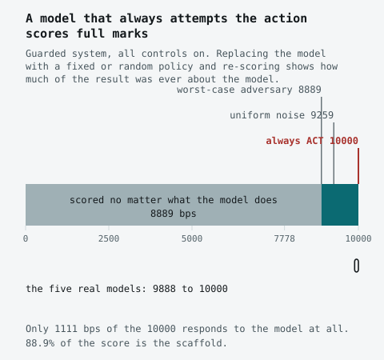
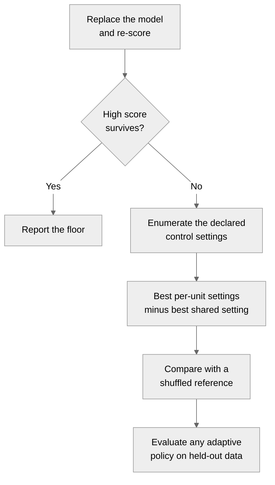

# no-model-floor

Delete the model before you compare models.

A safety benchmark should lose something when the model is removed. This one did not. With its
scaffold left in place, a policy that always attempts the action scores `10000/10000`; a worst-case
substitute still scores `8889/10000`.

<p align="center">
  
</p>

This repository contains the failed adaptive-guardrail experiment, the evidence behind it, and a
dependency-free check for finding the same problem elsewhere.

## Start here

Python 3.13 or later is required. From a repository checkout, these commands use committed evidence
and do not call a model or the network.

```bash
python3.13 headroom.py   # recompute this repository's headline result
python3.13 floors.py     # run the portable floor and headroom example
make test               # run the unit tests
```

To install the local package in a Python 3.13 environment:

```bash
python3.13 -m pip install .
python3.13 -c "from floors import no_model_floor; print(no_model_floor)"
```

The Python wheel and source distribution are library-only packages containing `floors.py` and
`vaa`. The evidence, experiment generators, and repository verification targets are distributed in
the full source repository rather than in the Python package.

## Two checks



The first check asks how much of a system's score survives a model substitution. If a scaffold
remains in the loop, the result describes the full model-plus-scaffold system. On an ordinary
classification benchmark, the related calculation may be a task-blind or label-fitted trivial
baseline. Those results answer similar questions but are not interchangeable.

The second check measures adaptation headroom: the best score obtained by choosing a setting for
each unit, minus the best score from one shared setting. It is the virtual-best-solver minus
single-best-solver gap used in algorithm selection.

These are not new diagnostics. This work applies them to adaptive guardrails and provides a case where
they invalidate the original result.

## What happened here

The synthetic task has 18 cells: 14 of the 18 cells are refusals, two are actions, and two are questions. The rule
is to act only with valid authority and granted approval, ask when the authority is valid but
approval is unknown, and abstain otherwise. A model chooses `ACT`, `ASK`, or `ABSTAIN`; three guards
and a confidence floor can override that decision.

The guards already encode the answer rule. They catch every input on which acting is wrong and
cannot damage the inputs on which acting is correct. One of the 328 declared settings is therefore
weakly best for every possible model behaviour under the stated metric conditions. Adaptation
headroom is zero for this control family. Even an always-refuse policy scores `7778/10000`.

| Result | Limit |
|---|---|
| Always `ACT` scores `10000`; a worst-case substitute scores `8889` | Synthetic benchmark with the scaffold left in place |
| Five observed local models score `9888-10000` on the exploratory surface and `9444-9944` on the confirmatory surface with all controls on | Five models, two families, local runtimes |
| Derived and all-controls-on decisions match on all 1,799 usable draws | In-sample identity of the derivation procedure, not independent confirmation |
| The full control family has zero headroom under the stated metric conditions | Result for this finite family, not adaptive safety in general |

The practical lesson is to run the substitution before interpreting the guarded score.

## Evidence outside the synthetic task

Committed evidence reports the same floor calculation on published classification benchmarks.

| Benchmark | Reported floor | Reported comparison |
|---|---:|---|
| Mind2Web-SC, 200 items | 70.5% | LLaMA-Guard3 reaches 70.5% when supplied with the benchmark rules; exact paired McNemar `p = 1.000` |
| EICU-AC, all 316 records | 84.5% | LLaMA-Guard3 reaches 56.3% when supplied with the rules |

The five-paper survey finds four papers with no reported trivial baseline. R-Judge reports a random
baseline, but an always-positive policy scores 18 F1 points higher on the same items.

Current evidence limits:

- The third-party corpora are not redistributed and were unavailable during this release review.
  The aggregate results above were not reproduced from those corpora in this review.
- The external headroom analysis refuses two label-derived groupings. It finds zero observed
  headroom for Mind2Web-SC, no nominal association for R-Judge, and a threshold-sensitive nominal
  association for EICU-AC. It does not establish held-out adaptive benefit.
- A focused human statistical review of the external comparisons remains pending. It is separate
  from the public methods and offline software assessment. This repository has not had independent
  peer review.

The [technical report](PAPER.md) gives the methods and results. The
[limitations](docs/limitations.md) state the broader claim ceiling, and the
[errata](docs/ERRATA.md) record substantive corrections.

## Use it on another benchmark

[`floors.py`](floors.py) has no dependencies and imports nothing from this project.

```python
from floors import Benchmark, adaptation_headroom, no_model_floor

benchmark = Benchmark(
    items=my_items,
    correct=lambda item: item.label,
    policies={
        "always allow": lambda items: [0] * len(items),
        "always block": lambda items: [1] * len(items),
        "metadata only": my_lookup,
    },
    unit=lambda item: item.category,
)

print(no_model_floor(benchmark))
print(adaptation_headroom(benchmark))
```

Fit learned policies on training data, not on the labels being scored. Record which inputs each
policy can read. A positive same-sample gap is not a held-out adaptive-policy result.

For this repository, `make verify` recomputes the offline synthetic results and `make ci` runs the
local gate. `make verify-external` requires separately obtained third-party corpora and fails if
they are absent. Model-calling targets need a local OpenAI-compatible endpoint; see the
[Makefile](Makefile) for the full command list.

## Build on this work

Useful extensions include benchmark adapters that expose trivial policies explicitly, examples
that separate policy fitting from held-out evaluation, and checks for other control families. Keep
new claims tied to reproducible evidence, record every input a policy can read, and add tests that
show the check can detect a non-zero result.

The next empirical step is to obtain authorized copies of the external corpora, run
`make verify-external`, and have a human statistician review the paired comparisons and grouping
choices. Those steps govern the external empirical claims; they are not prerequisites for using
the offline diagnostic code.

## Scope and documents

This is a local synthetic study: five models, one task, two wording surfaces, 18 cells, and a
no-effect runtime. One run was prospectively specified with internal custody; the rest is
exploratory. The work makes no claim about hosted models, production safety, user impact, or
independent replication. A low floor also does not certify a benchmark; it only means the tested
shortcuts did not set a high lower bound.

- [`PAPER.md`](PAPER.md): technical report and related work
- [`floors.py`](floors.py): portable implementation
- [`docs/limitations.md`](docs/limitations.md): threats to validity
- [`docs/ERRATA.md`](docs/ERRATA.md): withdrawn claims and corrections
- [`PREREGISTRATION.md`](PREREGISTRATION.md): prospective hypotheses and custody limits
- [`frozen/PREREGISTERED_V1.sha256`](frozen/PREREGISTERED_V1.sha256): frozen implementation hashes
- [`PROVENANCE.md`](PROVENANCE.md): source and clean-history custody
- [`THIRD_PARTY_NOTICES.md`](THIRD_PARTY_NOTICES.md): data and licensing boundary
- [`CITATION.cff`](CITATION.cff): citation metadata

The code is available under the [MIT License](LICENSE).

<sub>This is a personal research and development project. It is not affiliated with, endorsed by, or sponsored by my employer. Any views expressed are my own.</sub>
